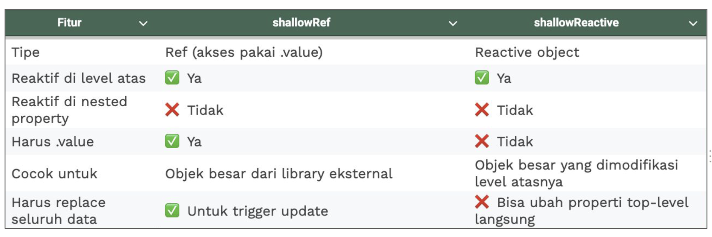
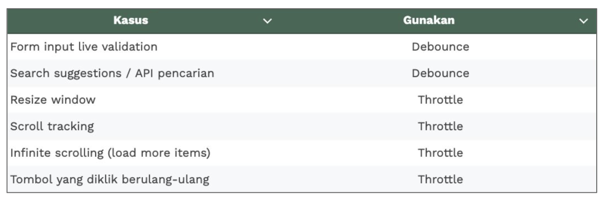

# Vue Optimization

## Why need optimization?
Sebenarnya Vue.js didesain ringan dan cepat. Tapi jika membuat aplikasi yang kompleks tanpa teknik optimasi yang tepat, performa bisa turun.

Tantangan Utama dalam performa Vue.js:
- **Over-reactivity** : Terlalu banyak reactivity yang tidak perlu.
- **Component re-render** : Komponen yang sering di-render ulang tanpa keperluan.
- **Large bundle size** : Ukuran bundle yang besar karena banyaknya dependensi.
- **Heavy DOM Operation** : Operasi DOM yang berat karena manipulasi yang tidak efisien, UI jadi lambat.

## What to do?

### [Reactivity Optimization](https://vuejs.org/guide/best-practices/performance#reduce-reactivity-overhead-for-large-immutable-structures)
Reactivity adalah fitur dimana Vue melacak perubahan data dan memperbarui DOM secara otomatis.

**How to optimize :**
- Gunakan `computed` dibanding `watch` untuk menghindari overhead reactivity.
- Gunakan `shallowReactive` atau `shallowRef` untuk struktur data besar yang tidak perlu reactivity mendalam.

[**Deep Reactivity Problem**](https://vuejs.org/guide/extras/reactivity-in-depth#reactivity-in-depth)

`ref` dan `reactive` pada secara default akan membuat deep reactivity (semua properti di dalam objek akan dilacak atau menjadi reaktif). Hal ini dapat menyebabkan overhead kinerja, (seperti data chart, geoJSON, konfigurasi kompleks) bisa membuat aplikasi lemot dan lamban merespons.

`shallowRef` dan `shallowReactive` hanya membuat top-level reactivity, alias tidak hanya melakukan perubahan (reaktif) pada tingkat paling atas. Hal ini tentu meningkatkan performa karena menghindari deep reactivity.

### Debounce & Throttle
Dalam Vue apps, event seperti input, scroll, atau resize dapat memicu terlalu banyak update atau API call. 

Maka, Gunakan `debounce` atau `throttle` untuk membatasi frekuensi eksekusi fungsi tersebut.
- **Debounce** : Menunda eksekusi fungsi sampai tidak ada event lagi selama X ms (delay)
- **Throttle** : Menjalankan fungsi maksimal sekali tiap X ms, walaupun event terus terjadi

### Reduce Component Re-render
Untuk menghindari komponen yang sering di-render ulang:
- Gunakan [`v-once`](https://vuejs.org/api/built-in-directives.html#v-once) untuk merender elemen hanya sekali, jika tidak ada perubahan yang diharapkan.
- Gunakan [`v-memo`](https://vuejs.org/api/built-in-directives.html#v-memo) untuk menghindari re-render komponen yang tidak perlu, dengan menyimpan hasil render sebelumnya.
- Gunakan [`v-show`](https://vuejs.org/api/built-in-directives.html#v-show) daripada [`v-if`](https://vuejs.org/api/built-in-directives.html#v-if) jika elemen hanya perlu disembunyikan, karena `v-show` hanya mengubah visibilitas CSS tanpa merender ulang.  

### Lazy Loading
Lazy loading adalah teknik untuk memuat komponen atau resource hanya saat dibutuhkan, bukan saat aplikasi dimuat pertama kali. Ini mengurangi ukuran bundle awal dan mempercepat loading awal.

Vue.js menyediakan dua pendekatan utama untuk menerapkan lazy loading :  
- Melalui [`Vue Router`](https://router.vuejs.org/guide/advanced/lazy-loading.html), di mana setiap rute dapat dimuat secara dinamis hanya saat dibutuhkan. 
- Dengan memanfaatkan fungsi [`defineAsyncComponent`](https://vuejs.org/guide/components/async#async-components) dari Vue.js untuk memuat komponen tertentu secara terpisah, sehingga aplikasi menjadi lebih ringan dan efisien.
- Gunakan [`Suspense`](https://vuejs.org/guide/built-ins/suspense) untuk menunggu asynchronus component selesai dimuat sebelum merendernya.

